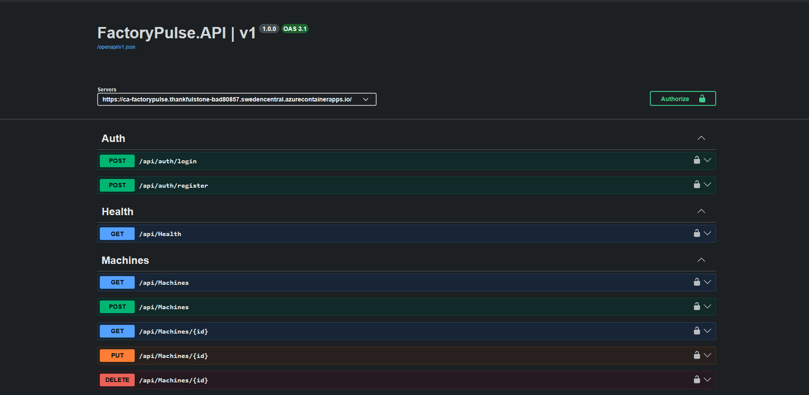
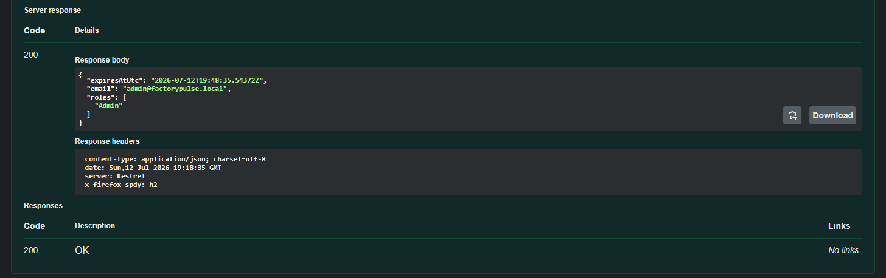

# FactoryPulse

[](https://github.com/wihanduplessis/FactoryPulse/actions/workflows/ci.yml)

A cloud-native manufacturing management API built with **.NET 10**, deployed to
**Azure** by a pipeline that stores **no secrets**.

FactoryPulse lets production managers and factory supervisors manage machines and
production orders — tracking machine state, order lifecycles, and the business rules
that govern them.

### ▶ Live: [ca-factorypulse.thankfulstone-bad80857.swedencentral.azurecontainerapps.io/swagger](https://ca-factorypulse.thankfulstone-bad80857.swedencentral.azurecontainerapps.io/swagger)

> The API scales to zero when idle and the database auto-pauses, so **the first request
> after a quiet period takes a few seconds** while both wake up. That is a deliberate
> trade — it is what keeps the whole environment at roughly $5/month
> ([ADR-0017](docs/adr/0017-container-apps-over-app-service.md)).



---

## What this demonstrates

Merging a pull request to `main` runs, unattended:

```
52 tests  →  build image  →  push to ACR  →  migrate Azure SQL  →  deploy  →  live
```


**There is no secret anywhere in that chain.**

- GitHub authenticates to Azure with **OIDC federated credentials** — no service
  principal password exists, and the trust is bound to this repository, on this branch.
- The container pulls its image with a **managed identity** — no registry credentials.
- It reads the JWT signing key from **Key Vault** as that same identity.
- It connects to **Azure SQL with no password**, because the server is Entra-only and a
  SQL login *cannot* be created on it.

Four of the six things that would conventionally be secrets **do not exist**. The two
that genuinely are secrets live in Key Vault.
See [ADR-0018](docs/adr/0018-passwordless-with-managed-identity.md) and
[ADR-0020](docs/adr/0020-deploy-with-oidc-federated-credentials.md).

---

## Features

- **Machine Management** — CRUD over factory machines and their status
  (`Idle`, `Running`, `Maintenance`, `Down`, `Retired`).
- **Production Orders** — a real domain, not a CRUD table:
  - state machine: `Planned → Running → Completed`, with `Cancelled` terminal
  - transition endpoints (`start` / `complete` / `cancel`) rather than a mutable status field
  - business rules: unique order numbers, quantity > 0, no orders on retired machines,
    valid end dates, no restarting cancelled orders
  - pagination and filtering (by status, machine, product)
- **JWT authentication & role-based authorization** — ASP.NET Core Identity, three roles
  (`Admin` / `Manager` / `Viewer`) enforced by policies, secure-by-default endpoints.
- **Hardened auth endpoints** — account lockout after repeated failures, and per-IP rate
  limiting on `login` (429 with `ProblemDetails`). Shipped **before** the API was
  publicly reachable ([ADR-0015](docs/adr/0015-api-hardening-before-public-exposure.md)).
- **Consistent error handling** — RFC `ProblemDetails`, correct status codes
  (400 / 401 / 403 / 404 / 409 / 429 / 500), all validation errors returned at once.
- **Structured logging & telemetry** — Serilog, enriched with the deployed commit SHA,
  into Application Insights.



---

## Architecture

**Clean Architecture** — all dependencies point inward toward a framework-free domain.

```
API  →  Application  →  Domain  ←  Infrastructure
        (business)     (core)      (EF Core / SQL)

Controller → Service → Repository → EF Core → SQL Server
```

- **Domain** — entities, enums, domain exceptions. No dependencies (not even EF).
- **Application** — services, DTOs, repository interfaces, mapping, validation, the
  `Result` pattern. Depends only on Domain.
- **Infrastructure** — EF Core `DbContext`, repositories, Identity. Implements the
  Application's interfaces.
- **API** — thin controllers translating `Result`s into HTTP responses.

### In Azure

```
GitHub Actions ──OIDC──► Azure
   │
   ├─ push image ──────► Container Registry
   ├─ apply migrations ─► Azure SQL          (as the CI identity — db_owner)
   └─ deploy ──────────► Container Apps
                              │  runs as a managed identity
                              ├─► Key Vault      (read secrets)
                              ├─► Azure SQL      (Entra auth — db_datareader/writer)
                              └─► App Insights
```

The running application holds `db_datareader` and `db_datawriter` — **not** `db_owner`.
It *cannot* alter its own schema. That is why migrations are applied by the pipeline
rather than on startup ([ADR-0019](docs/adr/0019-migrations-in-the-pipeline.md)): the
design makes the correct behaviour the only possible behaviour.

📄 A detailed visual overview is in **[docs/architecture-overview.pdf](docs/architecture-overview.pdf)**.

---

## Engineering practices

The decisions that make this more than CRUD — each one recorded as an
**[ADR](docs/adr/)** explaining the trade-off that was accepted:

- **Clean Architecture** with a project-per-layer split (boundaries enforced at compile time)
- **Rich domain model** for aggregates with a lifecycle — private setters, factories,
  encapsulated behaviour, invariant guards ([ADR-0009](docs/adr/0009-rich-domain-model-for-aggregates.md))
- **`Result<T>`** for expected outcomes; exceptions only for the unexpected ([ADR-0006](docs/adr/0006-result-for-expected-outcomes.md))
- **Repository pattern** behind interfaces owned by the business layer ([ADR-0004](docs/adr/0004-use-repository-pattern.md))
- **Infrastructure as code** — Bicep, one resource group, teardown in one command; and a
  **budget alert created before any resource existed** ([ADR-0016](docs/adr/0016-infrastructure-as-code-with-bicep.md))
- **Central Package Management**, FluentValidation, centralized audit fields, manual
  mapping (no runtime reflection)
- **52 tests** — xUnit · NSubstitute · Shouldly — including **integration tests** that run
  the real API against a **real SQL Server in Docker** (Testcontainers), in CI

## Technology

| Area | Tech |
|------|------|
| Language / runtime | C# / .NET 10 |
| Web | ASP.NET Core Web API |
| Data | Entity Framework Core, Azure SQL / SQL Server 2022 |
| Auth | ASP.NET Core Identity, JWT bearer, role-based policies |
| Validation | FluentValidation |
| Logging | Serilog → console, file, Application Insights |
| API docs | OpenAPI + Swagger UI |
| Containers | Docker (multi-stage build), Docker Compose |
| Testing | xUnit, NSubstitute, Shouldly, Testcontainers |
| CI/CD | GitHub Actions (OIDC — no stored secrets) |
| Cloud | Azure Container Apps, Azure SQL, Key Vault, Container Registry, Application Insights |
| IaC | Bicep |

---

## Running it yourself

### With Docker — the whole stack in two commands

The only prerequisite is [Docker Desktop](https://www.docker.com/products/docker-desktop/).
The .NET SDK builds *inside* the image and SQL Server runs in a container, so you need
neither installed.

```bash
cd infrastructure/docker
cp .env.example .env      # then edit .env — it documents the rules for each value
docker compose up -d --build
```

Open **http://localhost:8080/swagger** and log in via `POST /api/auth/login` with the
email and password you set in `.env`. The API applies its own migrations and seeds the
admin user on startup — locally, where that is safe.

```bash
docker compose logs -f api    # follow the API logs
docker compose down           # stop (data is preserved in a volume)
docker compose down -v        # stop and wipe the database
```

### For development

Prerequisites: [.NET 10 SDK](https://dotnet.microsoft.com/download) and Docker (for SQL
Server only).

```bash
cd infrastructure/docker
cp .env.example .env          # set MSSQL_SA_PASSWORD
docker compose up -d sqlserver
```

Then, from `backend/` — secrets go in .NET user-secrets, never in a file:

```bash
dotnet user-secrets set "ConnectionStrings:FactoryPulseDatabase" \
  "Server=localhost,1433;Database=FactoryPulseDb;User Id=sa;Password=<your .env password>;TrustServerCertificate=True;" \
  --project src/FactoryPulse.API

dotnet user-secrets set "JwtSettings:Key" "<at least 32 characters>" --project src/FactoryPulse.API
dotnet user-secrets set "SeedAdmin:Password" "<a password of your choosing>" --project src/FactoryPulse.API

dotnet run --project src/FactoryPulse.API
```

Open **https://localhost:7135/swagger**.

```bash
dotnet test    # 52 tests: unit + integration against a real SQL Server
```

### Deploying to your own Azure subscription

See **[infrastructure/azure/README.md](infrastructure/azure/README.md)** — including the
teardown, which is one command and returns the bill to zero.

---

## Project structure

```
FactoryPulse/
├── .github/workflows/ci.yml          # test → build → push → migrate → deploy
├── backend/
│   ├── src/
│   │   ├── FactoryPulse.Domain/          # entities, enums, exceptions (no dependencies)
│   │   ├── FactoryPulse.Application/     # services, DTOs, Result, interfaces, validation
│   │   ├── FactoryPulse.Infrastructure/  # EF Core, repositories, Identity
│   │   └── FactoryPulse.API/             # controllers, middleware, Program.cs
│   ├── tests/FactoryPulse.Tests/         # unit + Testcontainers integration tests
│   └── docker/Dockerfile.api             # multi-stage build
├── infrastructure/
│   ├── docker/                       # local SQL Server + API
│   └── azure/                        # Bicep: the entire cloud environment
└── docs/
    ├── adr/                          # 20 architecture decision records
    ├── design/                       # design notes written before each milestone
    └── architecture-overview.pdf
```

## Documentation

- **[Architecture Decision Records](docs/adr/)** — 20 records of *why*, not just *what*
- [Architecture overview (PDF)](docs/architecture-overview.pdf)
- [Design notes](docs/design/) — written before each milestone, not after
- [Roadmap](docs/Roadmap.md)

## License

See [LICENSE](LICENSE).
